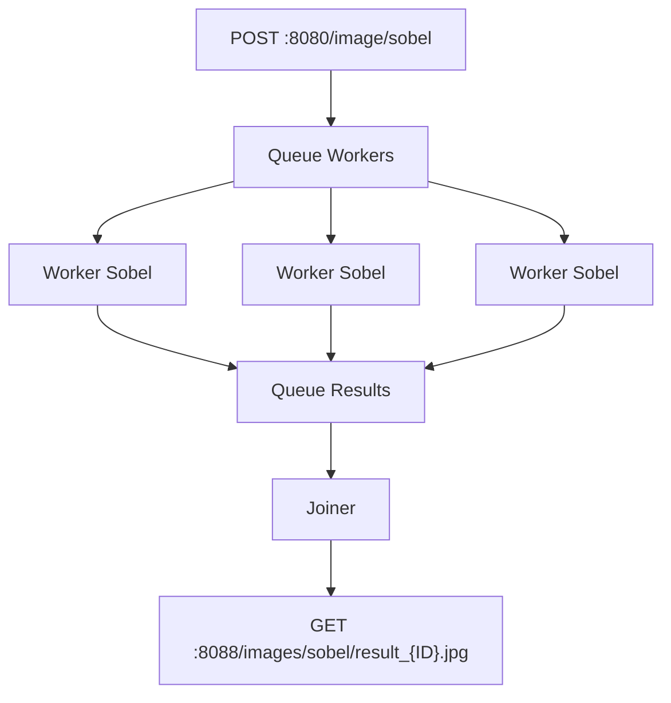

# Hit #1 — El operador de Sobel (“un equipo”)

## Etapa 2 — Distribuido.
 Desarrollen el mismo proceso de manera distribuida: dividan la imagen en N pedazos y asignen la tarea de aplicar la máscara a N procesos distribuidos (workers). Después unifiquen los resultados. Este es exactamente el patrón Master-Worker (también llamado Granja de Trabajadores) que Foster [FOS95] caracteriza como uno de los esquemas algorítmicos paralelos fundamentales. Ámbito: Docker.

## Ejecución
> [!NOTE] 
> Estan definidos los valores por defecto en el archivo .env. 
> Si no se encuentran utilizara los mismo.
 
> [!CAUTION]
> Como host default de rabbitmq se definio `localhost`, recuerde reemplarlo por la IP correcta en el `.env`.
~~~bash
cp .env.example .env
~~~

~~~bash
# Se proporciona un script para generar las imagenes de esta etapa
sh ./build-image.sh
~~~

Se definio un compose con un producer, 4 workers y un joiner
~~~bash
docker-compose -f compose.hit1.2.yml up
~~~

~~~bash
# parts cantidad de partes en las que se divide la imagen, mensajes que generará el producer
curl -X POST -F "file=@/path/to/image.jpg" -F "parts=10" http://localhost:8080/image/sobel
~~~
La imagen se puede ver en `http://localhost:8088/images/sobel/result_{ID}.jpg`, donde `{ID}` es un identificador único generado para cada imagen procesada.