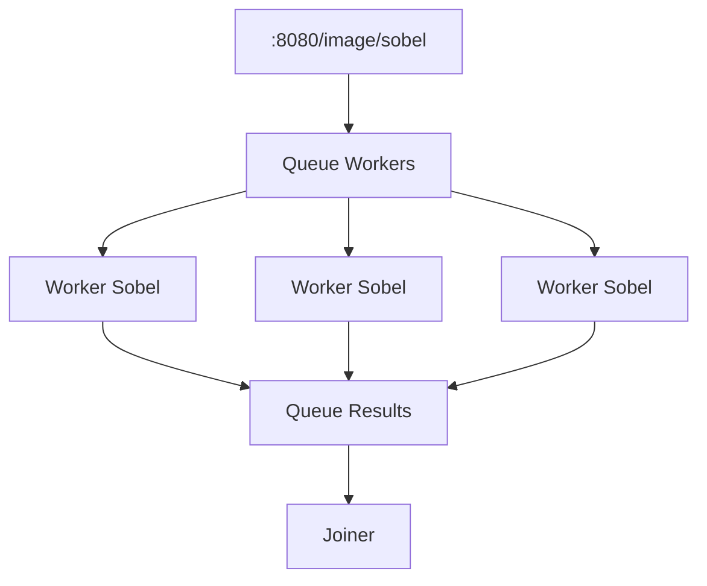

# Hit #1 — El operador de Sobel (“un equipo”)

## Etapa 2 — Distribuido.
 Desarrollen el mismo proceso de manera distribuida: dividan la imagen en N pedazos y asignen la tarea de aplicar la máscara a N procesos distribuidos (workers). Después unifiquen los resultados. Este es exactamente el patrón Master-Worker (también llamado Granja de Trabajadores) que Foster [FOS95] caracteriza como uno de los esquemas algorítmicos paralelos fundamentales. Ámbito: Docker.

## 
- [X] EP para recibir la imagen a procesar
- [X] Crear producer
    - [X] Dividir la imagen
- [X] Crear worker
  - [X] Escalar a gris
  - [X] Aplicar el filtro de Sobel a su parte asignada
- [X] Crear joiner
- [X] Crer EP para ver la imagen generada
- [ ] Dockerizar todo el sistema

## Ejecución
Este programa acepta solo imagenes JPG.
~~~bash
# Estan definidos los valores por defecto en el archivo .env, pero se pueden modificar si es necesario. 
# Si no se enecuentran utilizara los mismo.
# ATENCION QUE SE DEFINIO localhost para rabbitmq, si se ejecuta en docker es necesario cambiarlo por la ip del host o el nombre del servicio definido en el compose.
cp .env.example .env
~~~

Se proporciona un compose para ejecutar con 4 consumidores, es necesario hacer un build para generar las imagenes de los contenedores.
~~~bash
docker-compose -f compose.hi1.2.yml up --build
~~~

~~~bash
# parts cantidad de partes en las que se divide la imagen, mensajes que generará el producer
curl -X POST -F "file=@/path/to/image.jpg" -F "parts=10" http://localhost:8080/image/sobel
~~~
La imagen se puede ver en `http://localhost:8080/images/sobel/result_{ID}.jpg`, donde `{ID}` es un identificador único generado para cada imagen procesada.