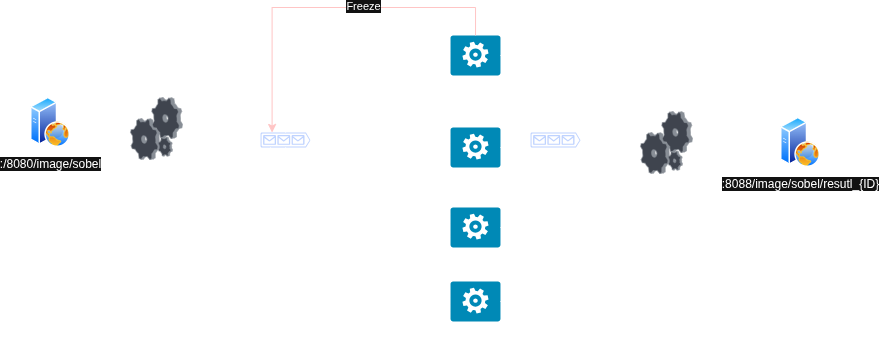

# Hit #1 — El operador de Sobel (“un equipo”)
## Etapa 3 — Tolerante a fallos
 Mejoren la aplicación de la Etapa 2 para que, en caso de que un worker (proceso distribuido al que se le asignó parte de la imagen a procesar) se caiga y no responda, el proceso principal detecte la situación y reasigne el cálculo a otro worker.

### Decisiones
    - Los consumidores tiene un delay de 2 segundos en enviar el mensaje de confirmación para permitir simular un congelamiento y detener el al mismo.
    -  Se definio que si se encola un mismo mensaje 4 veces, se descartara el mismo a una DLQ, para evitar mensajes toxicos.
    -  No se utiliza un backoff exponencial para reintentos, ya que se asume que el worker se recuperará en un tiempo razonable, y se prefiere una reasignación rápida para minimizar el tiempo de procesamiento total.

### Ejecución
Generamos las imagenes
~~~ bash
sh build-image.sh
~~~
Levantamos los contenedores
~~~ bash
docker compose -f compose.hi1.3.yml up -d
~~~
Se levantaron 4 workers, un rabbitmq, un joinner (para compaginar y poner a dispocision la imagen) y un producer (que divide y encola la imagen original).

Realizamos una petición POST al endpoint `/image/sobel` para procesar una imagen, indicando la cantidad de partes en las que se dividirá la imagen. Por ejemplo, para dividir la imagen en 10 partes:
~~~bash
# parts cantidad de partes en las que se divide la imagen, mensajes que generará el producer
curl -X POST -F "file=@/path/to/image.jpg" -F "parts=10" http://localhost:8080/image/sobel
~~~
La imagen se puede ver en `http://localhost:8088/images/sobel/result_{ID}.jpg`, donde `{ID}` es un identificador único generado para cada imagen procesada.

### Arquitectura
